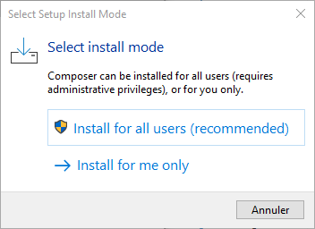
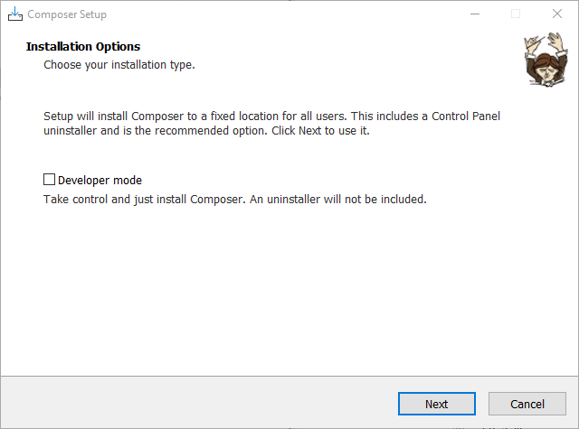
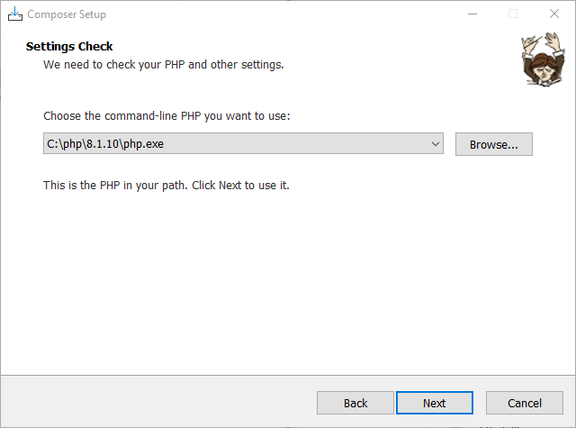
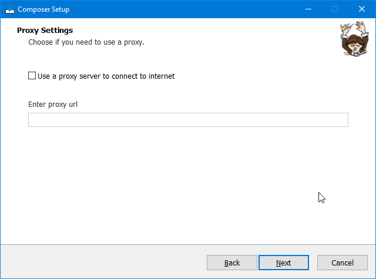
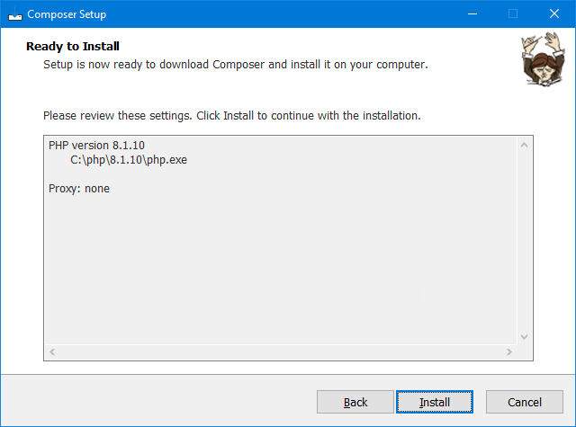
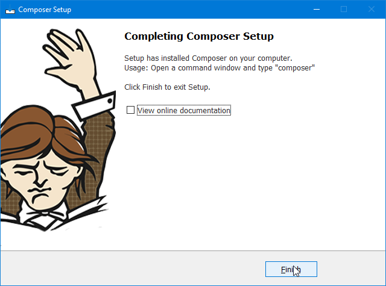

# Installation de PHP 8.1 & Composer sur Windows

Ceci est une petit guide pour installer PHP et Composer sur Windows.

## 1 - Télécharger PHP 8.1 et Composer pour Windows

- Télécharger PHP 8.1 :
    - [Zip VS16 x64 Thread Safe](https://windows.php.net/download/).
- Télécharger Composer :
    - [Composer-Setup.exe](https://getcomposer.org/download/)

## 2 - Installation de PHP 8.1

Décompresser et copier les contenu de fichier **zip** dans un nouvau dossier : `C:\php\8.1.10`.

## 3 - Installer Composer et ajouter PHP 8.1 au Path

Executer le fichier **Composer-Setup.exe**



Choisissez votre choix d'installation.



Choisissez le mode **developper** si vous voulez plus 😉 (j'ai pas test encore, déso 😁).



Normalement, l'installeur de composer détecte de lui-même l'installation de php. Si ce n'est pas le cas, choisissez le dossier en question ou réinstaller PHP.

De plus, si cela n'est pas le cas, Composer vous propose d'ajouter PHP à votre Path (une des variables de votre environement de développement).

Cela vous permettra d'accéder à Php via une console.



Non testé 🤷‍♂️😜.



Lance maintenant l'installation.



Voilà, c'est finis. 💪

## 4 - Vérifier l'installation de PHP 8.1 et Composer

Ouvrer une console et effectuer les commandes suivantes :

- pour vérifier Php : `php -v`
- pour vérifier Cmposer : `composer -v`

### 4.1 - PHP 8.1

Si Php est bien installé, voici que votre console afficher :

```
> php -v
PHP 8.1.10 (cli) (built: Aug 30 2022 18:05:49) (ZTS Visual C++ 2019 x64)
Copyright (c) The PHP Group
Zend Engine v4.1.10, Copyright (c) Zend Technologies
```

### 4.2 - Composer

```
> composer -v
   ______
  / ____/___  ____ ___  ____  ____  ________  _____
 / /   / __ \/ __ `__ \/ __ \/ __ \/ ___/ _ \/ ___/
/ /___/ /_/ / / / / / / /_/ / /_/ (__  )  __/ /
\____/\____/_/ /_/ /_/ .___/\____/____/\___/_/
                    /_/
Composer version 2.4.2 2022-09-14 16:11:15

Usage:
  command [options] [arguments]

Options:
  -h, --help                     Display help for the given command. When no command is given display help for the list command
  -q, --quiet                    Do not output any message
  -V, --version                  Display this application version
      --ansi|--no-ansi           Force (or disable --no-ansi) ANSI output
  -n, --no-interaction           Do not ask any interactive question
      --profile                  Display timing and memory usage information
      --no-plugins               Whether to disable plugins.
      --no-scripts               Skips the execution of all scripts defined in composer.json file.
  -d, --working-dir=WORKING-DIR  If specified, use the given directory as working directory.
      --no-cache                 Prevent use of the cache
  -v|vv|vvv, --verbose           Increase the verbosity of messages: 1 for normal output, 2 for more verbose output and 3 for debug

Available commands:
  about                Shows a short information about Composer
  archive              Creates an archive of this composer package
  audit                Checks for security vulnerability advisories for installed packages
  browse               [home] Opens the package's repository URL or homepage in your browser
  bump                 Increases the lower limit of your composer.json requirements to the currently installed versions
  check-platform-reqs  Check that platform requirements are satisfied
  clear-cache          [clearcache|cc] Clears composer's internal package cache
  completion           Dump the shell completion script
  config               Sets config options
  create-project       Creates new project from a package into given directory
  depends              [why] Shows which packages cause the given package to be installed
  diagnose             Diagnoses the system to identify common errors
  dump-autoload        [dumpautoload] Dumps the autoloader
  exec                 Executes a vendored binary/script
  fund                 Discover how to help fund the maintenance of your dependencies
  global               Allows running commands in the global composer dir ($COMPOSER_HOME)
  help                 Display help for a command
  init                 Creates a basic composer.json file in current directory
  install              [i] Installs the project dependencies from the composer.lock file if present, or falls back on the composer.json
  licenses             Shows information about licenses of dependencies
  list                 List commands
  outdated             Shows a list of installed packages that have updates available, including their latest version
  prohibits            [why-not] Shows which packages prevent the given package from being installed
  reinstall            Uninstalls and reinstalls the given package names
  remove               Removes a package from the require or require-dev
  require              [r] Adds required packages to your composer.json and installs them
  run-script           [run] Runs the scripts defined in composer.json
  search               Searches for packages
  self-update          [selfupdate] Updates composer.phar to the latest version
  show                 [info] Shows information about packages
  status               Shows a list of locally modified packages
  suggests             Shows package suggestions
  update               [u|upgrade] Updates your dependencies to the latest version according to composer.json, and updates the composer.lock file        
  validate             Validates a composer.json and composer.lock
```